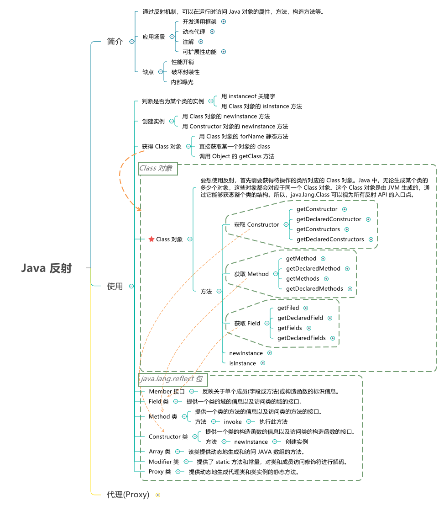

# 序列化和反序列化

```
序列化（serialization）：将对象的状态信息可以存储或传输的形式的过程。在序列化期间，对象将其当前状态写入到临时或持久性存储区。
反序列化：从存储区中读取该数据，并将其还原为对象的过程，称为反序列化
```


```java
package SerialTest;
import java.io.*;
public class Main{
    public static void main(String args[])throws Exception{
          //定义obj对象
        String obj="hello world!";
          //创建一个包含对象进行反序列化信息的”object”数据文件
        FileOutputStream fos=new FileOutputStream("object");
        ObjectOutputStream os=new ObjectOutputStream(fos);
          //writeObject()方法将obj对象写入object文件
        os.writeObject(obj);
        os.close();
          //从文件中反序列化obj对象
        FileInputStream fis=new FileInputStream("object");
        ObjectInputStream ois=new ObjectInputStream(fis);
          //恢复对象
        Object obj2=ois.readObject();
        System.out.print(obj2);
        ois.close();
    }
}
```

写到文件里试一试

```java
package SerialTest;
import java.io.*;
public class Main{
    public static void main(String args[])throws Exception{
          //定义obj对象
        String obj="hello world!";
          //创建一个包含对象进行反序列化信息的”object”数据文件
        FileOutputStream fos=new FileOutputStream(new File("serial.txt"));
        ObjectOutputStream os=new ObjectOutputStream(fos);
          //writeObject()方法将obj对象写入object文件
        os.writeObject(obj);
        os.close();
          //从文件中反序列化obj对象
        FileInputStream fis=new FileInputStream(new File("serial.txt"));
        ObjectInputStream ois=new ObjectInputStream(fis);
          //恢复对象
        Object obj2=ois.readObject();
        System.out.print(obj2);
        ois.close();
    }
}
```


这就完成了序列化与反序列化的过程,

```
aced0005是java序列化后的开头(如果用txt打开文件就可以看见)
rO0AB是java反序列化后再进行base64的开头
aced是java反序列化后16进制的开头
```

# 反序列化与命令执行

首先来看一下java里的命令执行

```java
import java.io.*;
public class Main{
	public static void main(String args[]) throws Exception{
Process p=Runtime.getRuntime().exec("whoami");
		java.io.InputStream is=p.getInputStream();
		BufferedReader reader=new BufferedReader(new InputStreamReader(is));
		p.waitFor();
		System.out.println(reader.readLine()); //laptop-59v7a91d\86136
	}
} 
```

好叭,说实话,刚学java,还看不懂是怎么输出的,但是java里的命令执行函数是`Runtime.getRuntime().exec();`而且是没有回显的,可能要根据一些流才能输出,dnslog一下发现命令也确实是没有回显但可以执行的。

```java
package SerialTest;
import java.io.*;
public class Main{
    public static void main(String args[]) throws Exception{
        //定义myObj对象
        MyObject myObj = new MyObject();
        myObj.name = "hi";
        //创建一个包含对象进行反序列化信息的”object”数据文件
        FileOutputStream fos = new FileOutputStream("object");
        ObjectOutputStream os = new ObjectOutputStream(fos);
        //writeObject()方法将myObj对象写入object文件
        os.writeObject(myObj);
        os.close();
        //从文件中反序列化obj对象
        FileInputStream fis = new FileInputStream("object");
        ObjectInputStream ois = new ObjectInputStream(fis);
        //恢复对象
        MyObject objectFromDisk = (MyObject)ois.readObject();
        System.out.println(objectFromDisk.name);
        ois.close();
    }
}

class MyObject implements Serializable{
    public String name;
    //重写readObject()方法
    private void readObject(java.io.ObjectInputStream in) throws IOException, ClassNotFoundException{
        //执行默认的readObject()方法
        in.defaultReadObject();
        //执行打开计算器程序命令
        Runtime.getRuntime().exec("calc");
    }
}
```

效果:


# 反射类

关于反射:[https://www.cnblogs.com/chanshuyi/p/head_first_of_reflection.html#%E4%B8%80%E4%B8%AA%E7%AE%80%E5%8D%95%E7%9A%84%E4%BE%8B%E5%AD%90](https://www.cnblogs.com/chanshuyi/p/head_first_of_reflection.html#一个简单的例子)



本地练习一下:

```java
import java.io.*;
import java.lang.reflect.*;


    public class Main{
    	public static void main(String args[]) throws Exception{
demo a=new demo();
    	Class c1=demo.class;
    	 Constructor m = c1.getDeclaredConstructor(String.class,String.class);
    	 demo demo2=(demo)m.newInstance("constrage","constrname");
         System.out.println(demo2.age);
    	 Method me=c1.getMethod("Method2",String.class);
    	 Object meth=me.invoke(demo2,"invoke");
    	 
    	 
    	 System.out.println(new demo().age);
    	 System.out.print(meth);
    }
    	
}
    class demo {
        public String age="noage";
        public String name="noname";
        public demo() {}
        public demo(String name,String age) {// 构造函数，初始化时执行
            this.age = age;
            this.name = name;
        }
        public String Method2(String a) {//  方法 
            this.age = "Methodage"+a;
            this.name = "Methodname";
            return this.age;
        }
    }
```

输出

```java
constrname
noage
Methodageinvoke
```

同样,我们也可以用反射类来进行命令执行

```java
package SerialTest;

import java.lang.reflect.*;
public class Main {
    public static void main(String[] args) throws Exception {
    	Class c1 = Class.forName("java.lang.Runtime");
    	c1.getMethod("exec", String.class).invoke(c1.getMethod("getRuntime").invoke(c1),"calc");
    }
}
```

# 反序列化的检测

### 代码审计

重点关注一些反序列化操作函数并判断输入是否可控
基本思路：

**1、通过检索源码中对反序列化函数的调用来静态寻找反序列化的输入点**
可以搜索以下函数：

```
ObjectInputStream.readObject
ObjectInputStream.readUnshared
XMLDecoder.readObject
Yaml.load
XStream.fromXML
ObjectMapper.readValue
JSON.parseObject
```

小数点前面是类名，后面是方法名

**2、确定了反序列化输入点后，再考察应用的Class Path中是否包含Apache Commons Collections等危险库（ysoserial所支持的其他库亦可)**

**3、若不包含危险库，则查看一些涉及命令、代码执行的代码区域，防止程序员代码不严谨，导致bug**

**4、若包含危险库，则使用ysoserial进行攻击复现**

https://github.com/frohoff/ysoserial/

### 白盒审计

大型企业的应用很多，每个都人工去审计不现实，往往都有相应的自动化静态代码审计工具，这里以ObjectInputStream.readObject()为例，其它原理也相似。在自动化检测时，可通过实现解析java源代码，检测readObject()方法调用时判断其对象是否为java.io.ObjectOutputStream。如果此时ObjectInputStream对象的初始化参数来自外部请求输入参数则基本可以确定存在反序列化漏洞了。这是只需确认是否存在相应的安全修复即可。 检测方式可参考lgtm.com对于Deserialization of user-controlled data的实现

### 黑盒审计

调用ysoserial并依次生成各个第三方库的利用payload(也可以先分析依赖第三方包量，调用最多的几个库的paylaod即可)，该payload构造为访问特定url链接的payload，根据http访问请求记录判断反序列化漏洞是否利用成功。如：

```
java -jar ysoserial.jar CommonsCollections1 'curl " + URL + " '
```

也可通过DNS解析记录确定漏洞是否存在。现成的轮子很多，推荐NickstaDB写的[SerialBrute](https://github.com/NickstaDB/BaRMIe)，还有一个针对RMI的测试工具BaRMIe，也很不错。

### 攻击检测

通过查看反序列化后的数据，可以看到反序列化数据开头包含两字节的魔术数字，这两个字节始终为十六进制的0xAC ED。接下来是两字节的版本号。我只见到过版本号为5（0x00 05）的数据。考虑到zip、base64各种编码，在攻击检测时可针对该特征进行匹配请求post中是否包含反序列化数据，判断是否为反序列化漏洞攻击。

```
xxxdeMacBook-Pro:demo xxx$ xxd objectexp 
    00000000: aced 0005 7372 0032 7375 6e2e 7265 666c  ....sr.2sun.refl
    00000010: 6563 742e 616e 6e6f 7461 7469 6f6e 2e41  ect.annotation.A
    00000020: 6e6e 6f74 6174 696f 6e49 6e76 6f63 6174  nnotationInvocat
    00000030: 696f 6e48 616e 646c 6572 55ca f50f 15cb  ionHandlerU.....
```

但仅从特征匹配只能确定有攻击尝试请求，还不能确定就存在反序列化漏洞，还要结合请求响应、返回内容等综合判断是否确实存在漏洞。

### RASP检测

Java程序中类`ObjectInputStream`的`readObject`方法被用来将数据流反序列化为对象，如果流中的对象是class，则它的ObjectStreamClass描述符会被读取，并返回相应的class对象，ObjectStreamClass包含了类的名称及serialVersionUID。

类的名称及serialVersionUID的ObjectStreamClass描述符在序列化对象流的前面位置，且在`readObject`反序列化时首先会调用resolveClass读取反序列化的类名，所以RASP检测反序列化漏洞时可通过重写ObjectInputStream对象的resolveClass方法获取反序列化的类即可实现对反序列化类的黑名单校验。

### 其他

1.从流量中发现序列化的痕迹，关键字：ac ed 00 05，rO0AB
2.Java RMI的传输100%基于反序列化，Java RMI的默认端口是1099端口
3.从源码入手，可以被序列化的类一定实现了Serializable接口
4.观察反序列化时的readObject()方法是否重写，重写中是否有设计不合理，可以被利用之处

从可控数据的反序列化或间接的反序列化接口入手，再在此基础上尝试构造序列化的对象。

ysoserial是一款非常好用的Java反序列化漏洞检测工具，该工具通过多种机制构造PoC，并灵活的运用了反射机制和动态代理机制，值得学习和研究。

# 反序列化的防御

**1.类白名单校验**

在`ObjectInputStream`中resolveClass 里只是进行了class 是否能被load，自定义ObjectInputStream, 重载resolveClass的方法，对className 进行白名单校验

```
public final class test extends ObjectInputStream{
    ...
    protected Class<?> resolveClass(ObjectStreamClass desc)
            throws IOException, ClassNotFoundException{
         if(!desc.getName().equals("className")){
            throw new ClassNotFoundException(desc.getName()+" forbidden!");
        }
        returnsuper.resolveClass(desc);
    }
      ...
}
```

**2.禁止JVM执行外部命令Runtime.exec**

通过扩展SecurityManager可以实现:

```
SecurityManager originalSecurityManager = System.getSecurityManager();
        if (originalSecurityManager == null) {
            // 创建自己的SecurityManager
            SecurityManager sm = new SecurityManager() {
                private void check(Permission perm) {
                    // 禁止exec
                    if (perm instanceof java.io.FilePermission) {
                        String actions = perm.getActions();
                        if (actions != null && actions.contains("execute")) {
                            throw new SecurityException("execute denied!");
                        }
                    }
                    // 禁止设置新的SecurityManager，保护自己
                    if (perm instanceof java.lang.RuntimePermission) {
                        String name = perm.getName();
                        if (name != null && name.contains("setSecurityManager")) {
                            throw new SecurityException("System.setSecurityManager denied!");
                        }
                    }
                }

                @Override
                public void checkPermission(Permission perm) {
                    check(perm);
                }

                @Override
                public void checkPermission(Permission perm, Object context) {
                    check(perm);
                }
            };

            System.setSecurityManager(sm);
        }
```

Java反序列化大多存在复杂系统间相互调用，控制，或较为底层的服务应用间交互等应用场景上，因此接口本身可能就存在一定的安全隐患。Java反序列化本身没有错，而是面对不安全的数据时，缺乏相应的防范，导致了一些安全问题。并且不容忽视的是，也许某些Java服务没有直接使用存在漏洞的Java库，但只要Lib中存在存在漏洞的Java库，依然可能会受到威胁。

# 修复Java反序列化漏洞

### 1、通过Hook resolveClass来校验反序列化的类

在使用`readObject()`反序列化时首先会调用resolveClass方法读取反序列化的类名，所以这里通过重写`ObjectInputStream`对象的resolveClass方法即可实现对反序列化类的校验。

具体实现代码Demo如下:

```
public class AntObjectInputStream extends ObjectInputStream{
    public AntObjectInputStream(InputStream inputStream)
            throws IOException {
        super(inputStream);
    }

    /**
     * 只允许反序列化SerialObject class
     */
    @Override
    protected Class<?> resolveClass(ObjectStreamClass desc) throws IOException,
            ClassNotFoundException {
        if (!desc.getName().equals(SerialObject.class.getName())) {
            throw new InvalidClassException(
                    "Unauthorized deserialization attempt",
                    desc.getName());
        }
        return super.resolveClass(desc);
    }
}
```

通过此方法，可灵活的设置允许反序列化类的白名单，也可设置不允许反序列化类的黑名单。但反序列化漏洞利用方法一直在不断的被发现，黑名单需要一直更新维护，且未公开的利用方法无法覆盖。

```
org.apache.commons.collections.functors.InvokerTransformer
org.apache.commons.collections.functors.InstantiateTransformer
org.apache.commons.collections4.functors.InvokerTransformer
org.apache.commons.collections4.functors.InstantiateTransformer
org.codehaus.groovy.runtime.ConvertedClosure
org.codehaus.groovy.runtime.MethodClosure
org.springframework.beans.factory.ObjectFactory
com.sun.org.apache.xalan.internal.xsltc.trax.TemplatesImpl
org.apache.commons.fileupload
org.apache.commons.beanutils
```

根据以上方法，有大牛实现了线程的[SerialKiller](https://github.com/ikkisoft/SerialKiller)包可供使用。

### 2.使用ValidatingObjectInputStream来校验反序列化的类

使用Apache Commons IO Serialization包中的ValidatingObjectInputStream类的accept方法来实现反序列化类白/黑名单控制，具体可参考ValidatingObjectInputStream介绍；示例代码如下:

```
private static Object deserialize(byte[] buffer) throws IOException,
ClassNotFoundException , ConfigurationException {
    Object obj;
    ByteArrayInputStream bais = new ByteArrayInputStream(buffer);
    // Use ValidatingObjectInputStream instead of InputStream
    ValidatingObjectInputStream ois = new   ValidatingObjectInputStream(bais); 

    //只允许反序列化SerialObject class
    ois.accept(SerialObject.class);
    obj = ois.readObject();
    return obj;
}
```

### 3.使用contrast-rO0防御反序列化攻击

contrast-rO0是一个轻量级的agent程序，通过通过重写ObjectInputStream来防御反序列化漏洞攻击。使用其中的SafeObjectInputStream类来实现反序列化类白/黑名单控制，示例代码如下:

```
SafeObjectInputStream in = new SafeObjectInputStream(inputStream, true);
in.addToWhitelist(SerialObject.class);

in.readObject();
```

### 4.使用ObjectInputFilter来校验反序列化的类

Java 9包含了支持序列化数据过滤的新特性，开发人员也可以继承java.io.ObjectInputFilter类重写checkInput方法实现自定义的过滤器，，并使用ObjectInputStream对象的setObjectInputFilter设置过滤器来实现反序列化类白/黑名单控制。示例代码如下:

```
import java.util.List;
import java.util.Optional;
import java.util.function.Function;
import java.io.ObjectInputFilter;
class BikeFilter implements ObjectInputFilter {
    private long maxStreamBytes = 78; // Maximum allowed bytes in the stream.
    private long maxDepth = 1; // Maximum depth of the graph allowed.
    private long maxReferences = 1; // Maximum number of references in a graph.
    @Override
    public Status checkInput(FilterInfo filterInfo) {
        if (filterInfo.references() < 0 || filterInfo.depth() < 0 || filterInfo.streamBytes() < 0 || filterInfo.references() > maxReferences || filterInfo.depth() > maxDepth|| filterInfo.streamBytes() > maxStreamBytes) {
            return Status.REJECTED;
        }
        Class<?> clazz = filterInfo.serialClass();
        if (clazz != null) {
            if (SerialObject.class == filterInfo.serialClass()) {
                return Status.ALLOWED;
            }
            else {
                return Status.REJECTED;
            }
        }
        return Status.UNDECIDED;
    } // end checkInput
} // end class BikeFilter
```

上述示例代码，仅允许反序列化SerialObject类对象。

### 5、禁止JVM执行外部命令`Runtime.exec`

通过扩展SecurityManager

```
SecurityManager originalSecurityManager = System.getSecurityManager();
        if (originalSecurityManager == null) {
            // 创建自己的SecurityManager
            SecurityManager sm = new SecurityManager() {
                private void check(Permission perm) {
                    // 禁止exec
                    if (perm instanceof java.io.FilePermission) {
                        String actions = perm.getActions();
                        if (actions != null && actions.contains("execute")) {
                            throw new SecurityException("execute denied!");
                        }
                    }
                    // 禁止设置新的SecurityManager，保护自己
                    if (perm instanceof java.lang.RuntimePermission) {
                        String name = perm.getName();
                        if (name != null && name.contains("setSecurityManager")) {
                            throw new SecurityException("System.setSecurityManager denied!");
                        }
                    }
                }

                @Override
                public void checkPermission(Permission perm) {
                    check(perm);
                }

                @Override
                public void checkPermission(Permission perm, Object context) {
                    check(perm);
                }
            };

            System.setSecurityManager(sm);
        }
```

### 6、不建议使用的黑名单

在反序列化时设置类的黑名单来防御反序列化漏洞利用及攻击，这个做法在源代码修复的时候并不是推荐的方法，因为你不能保证能覆盖所有可能的类，而且有新的利用payload出来时也需要随之更新黑名单，但有一种场景下可能黑名单是一个不错的选择。写代码的时候总会把一些经常用到的方法封装到公共类，这样其它工程中用到只需要导入jar包即可，此前已经见到很多提供反序列化操作的公共接口，使用第三方库反序列化接口就不好用白名单的方式来修复了。这个时候作为第三方库也不知道谁会调用接口，会反序列化什么类，所以这个时候可以使用黑名单的方式来禁止一些已知危险的类被反序列化，具体的黑名单类可参考contrast-rO0、ysoserial中paylaod包含的类。


参考链接:https://paper.seebug.org/312/

https://xz.aliyun.com/t/6787

https://developer.aliyun.com/article/766982

https://xz.aliyun.com/t/9117#toc-14