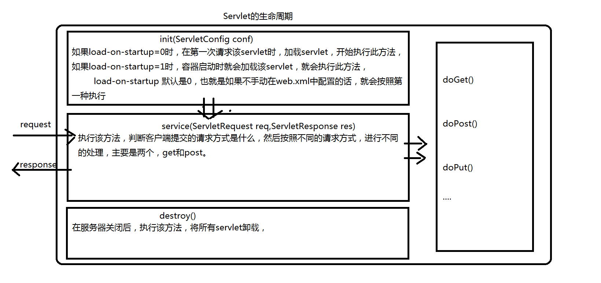

# 一、什么是servlet？

　　　　处理请求和发送响应的过程是由一种叫做Servlet的程序来完成的，并且Servlet是为了解决实现动态页面而衍生的东西。理解这个的前提是了解一些http协议的东西，并且知道B/S模式(浏览器/服务器)。

　　　　B/S:浏览器/服务器。 浏览器通过网址来访问服务器，比如访问百度，在浏览器中输入www.baidu.com，这个时候浏览器就会显示百度的首页，那么这个具体的过程，步骤是怎样的呢？这个就了解一下[http请求和响应](http://www.cnblogs.com/whgk/p/6130882.html)了

　　　　　　　　　　　　　　　　　　[](https://images2015.cnblogs.com/blog/874710/201702/874710-20170214192940050-671180063.png)

　　　　请求，响应：通过给的链接应该可以知道这两个具体的内容

 

# 二、tomcat和servlet的关系

　　　　Tomcat 是Web应用服务器,是一个Servlet/JSP容器. Tomcat 作为Servlet容器,负责处理客户请求,把请求传送给Servlet,并将Servlet的响应传送回给客户.而Servlet是一种运行在支持Java语言的服务器上的组件. Servlet最常见的用途是扩展Java Web服务器功能,提供非常安全的,可移植的,易于使用的CGI替代品.

　　　　从http协议中的请求和响应可以得知，浏览器发出的请求是一个请求文本，而浏览器接收到的也应该是一个响应文本。但是在上面这个图中，并不知道是如何转变的，只知道浏览器发送过来的请求也就是request，我们响应回去的就用response。忽略了其中的细节，现在就来探究一下。

　　　　　　　　　　　　　　[](https://images2015.cnblogs.com/blog/874710/201702/874710-20170214204632894-1786729693.png)

　　　　　　①：Tomcat将http请求文本接收并解析，然后封装成HttpServletRequest类型的request对象，所有的HTTP头数据读可以通过request对象调用对应的方法查询到。

　　　　　　②：Tomcat同时会要响应的信息封装为HttpServletResponse类型的response对象，通过设置response属性就可以控制要输出到浏览器的内容，然后将response交给tomcat，tomcat就会将其变成响应文本的格式发送给浏览器

　

　　　　Java Servlet API 是Servlet容器(tomcat)和servlet之间的接口，它定义了serlvet的各种方法，还定义了Servlet容器传送给Servlet的对象类，其中最重要的就是ServletRequest和ServletResponse。所以说我们在编写servlet时，需要实现Servlet接口，按照其规范进行操作。

 

# 三、编写Servlet

　　　　在前面，我们已经知道了servlet是什么，为什么需要servlet?（为了实现动态网页，而不是显示静态网页，具体情况可以百度查查），tomcat和servlet的关系？等问题。现在来手动编写一个Servlet。

　　　　3.1、手动编写servlet。

　　　　　　1、创建一个MyServlet继承HttpServlet，重写doGet和doPost方法，也就是看请求的方式是get还是post，然后用不同的处理方式来处理请求，

```java


import javax.servlet.ServletException;
import javax.servlet.annotation.WebServlet;
import javax.servlet.http.HttpServlet;
import javax.servlet.http.HttpServletRequest;
import javax.servlet.http.HttpServletResponse;
import java.io.IOException;

/**
 * 数显Servlet
 * 1.创建普通java类
 * 2.实现Servlet的规范,继承HttpServlet类
 * 3.重写service方法,用来处理请求
 * 4.设置注释,指定访问路径
 * */
@WebServlet("/ser001")

//@WebServlet(name="servlet01",value="/ser01")
//@WebServlet(name="servlet01",urlPatterns={"/ser01","/ser02"})
public class ser01 extends HttpServlet {
    //ctrl+o快速重写


    @Override
    protected void service(HttpServletRequest req, HttpServletResponse resp) throws ServletException, IOException {

        System.out.println("hello servlet!");
        //通过流输出数据到浏览器
        resp.getWriter().write ("hello servlet!");
    }


}

```

　　　　　　2、在web.xml中配置MyServlet，为什么需要配置？让浏览器发出的请求知道到达哪个servlet，也就是让tomcat将封装好的request找到对应的servlet让其使用。

　　　　　　　　　　　　配置四个东西。

　　　　　　　　　　　　　　　　[](https://images2015.cnblogs.com/blog/874710/201702/874710-20170216094000972-1276129522.png)

　　　　　　　　　　　　配置之后，浏览器是如何通过我们配置的信息来找到对应的servlet的。

　　　　　　　　　　　　　　　　[](https://images2015.cnblogs.com/blog/874710/201702/874710-20170216094053504-915571176.png)

　　　　　　　　　　　　按照步骤，首先浏览器通过http://localhost:8080/test01/MyServlet来找到web.xml中的url-pattern，这就是第一步，匹配到了url-pattern后，就会找到第二步servlet的名字MyServlet，知道了名字，就可以通过servlet-name找到第三步，到了第三步，也就能够知道servlet的位置了。然后到其中找到对应的处理方式进行处理。

　　　　　　　3、实验，验证上面配置成功。

　　　　　　　　　　　　[](https://images2015.cnblogs.com/blog/874710/201702/874710-20170216094649550-2096214829.png)　　　

　　　　　　　　　　　　[](https://images2015.cnblogs.com/blog/874710/201702/874710-20170216094700035-984507451.png)

　　　　3.2、利用向导新建MyServlet

　　　　　　　　这个就相对简单了，web.xml不用我们手动配置，工具直接帮我们自动配置了

　　　　　　　　　　　　1、右击项目，在new选项中有直接新建servlet的选项

　　　　　　　　　　　　2、配置MyServlet类中的信息

　　　　　　　　　　　　　　　[](https://images2015.cnblogs.com/blog/874710/201702/874710-20170216095540332-191821755.png)　

　　　　　　　　　　3、配置web.xml中的servlet信息

　　　　　　　　　　　　　　　[](https://images2015.cnblogs.com/blog/874710/201702/874710-20170216095633754-1304935718.png)　　　

　　　　　　　　4、查看MyServle01类中的代码和web.xml，其中的配置跟手动的配置是一样的，只是用图形化界面，让我们更方便的创建servlet而产生的。

 

## 详解创建servlet的原理

1、servlet的生命周期是什么？

2、为什么创建的servlet是继承自httpServlet，而不是直接实现Servlet接口？

3、servlet的生命周期中，可以看出，执行的是service方法，为什么我们就只需要写doGet和doPost方法呢？

等这一系列的问题，我们都应该知道，而不应该就单纯的知道如何配置和使用servlet?上面的问题，一一来解答。

### servlet的生命周期是什么？

服务器启动时(web.xml中配置load-on-startup=1，默认为0)或者第一次请求该servlet时，就会初始化一个Servlet对象，也就是会执行初始化方法init(ServletConfig conf)

该servlet对象去处理所有客户端请求，在service(ServletRequest req，ServletResponse res)方法中执行

最后服务器关闭时，才会销毁这个servlet对象，执行destroy()方法。

　　　　　　　　　　　　　　[](https://images2015.cnblogs.com/blog/874710/201702/874710-20170216103737254-1072057229.png)


 　　　　　　　　　　　　　　　　　　　

# 四、几个重点的对象。

ServletConfig、ServletContext，request、response

讲解四大类，ServletConfig对象，ServletContext对象、request对象，response对象

ServletConfig对象

获取途径：getServletConfig(); 

功能：上面大概提及了一下，能得到四个东西，

　　　　　　　　　　　　　　[](https://images2015.cnblogs.com/blog/874710/201702/874710-20170216193829863-177507047.png)

getServletName(); //获取servlet的名称，也就是我们在web.xml中配置的servlet-name

getServletContext(); //获取ServletContext对象，该对象的作用看下面讲解

getInitParameter(String); //获取在servlet中初始化参数的值。这里注意与全局初始化参数的区分。这个获取的只是在该servlet下的初始化参数

　　　　　　　　　　　　　　　　[](https://images2015.cnblogs.com/blog/874710/201702/874710-20170216195140550-371826071.png)

getInitParameterNames(); //获取在Servlet中所有初始化参数的名字，也就是key值，可以通过key值，来找到各个初始化参数的value值。注意返回的是枚举类型　　　　　　

# HTTPServletRequest对象　　　　　　　　　　　　

httpservletRequest是servletRequest的子接口,该对象在Service方法中由服务器传输过来

**HttpServletRequest常用方法**

​				


| getRequestURL    | 客户端发出请求时的完整URL       |
| ---------------- | ------------------------------- |
| getRequestURI    | 请求行中的资源名部分            |
| getQueryString   | 请求行中的参数部分（参数名+值） |
| getRemoteAddr    | 发出请求的客户机的IP地址        |
| getMethod        | 返回请求方式就                  |
| getRemoteHost    | 发出请求的客户机的完整主机名    |
| getRemotePortweb | 服务器所使用的网络端口号        |
| getLocalPortweb  | 服务器所使用的网络端口号        |
| getLocalAddrweb  | 服务器的IP地址                  |
| getLocalNameweb  | 服务器的主机名                  |

代码演示

```Java


import javax.servlet.ServletException;
import javax.servlet.annotation.WebServlet;
import javax.servlet.http.HttpServlet;
import javax.servlet.http.HttpServletRequest;
import javax.servlet.http.HttpServletResponse;
import java.io.IOException;

/**
 * 数显Servlet
 * 1.创建普通java类
 * 2.实现Servlet的规范,继承HttpServlet类
 * 3.重写service方法,用来处理请求
 * 4.设置注释,指定访问路径
 * */
@WebServlet("/ser001")

//@WebServlet(name="servlet01",value="/ser01")
//@WebServlet(name="servlet01",urlPatterns={"/ser01","/ser02"})
public class ser01 extends HttpServlet {
    //ctrl+o快速重写


    @Override
    protected void service(HttpServletRequest request, HttpServletResponse resp) throws ServletException, IOException {

        String url = request.getRequestURL().toString();
        System.out.println("URL:"+url);
        System.out.println("URL:"+url+"<br>");
        // 得到URI
        String uri = request.getRequestURI();
        System.out.println("URI:"+uri);
        System.out.println("URI:"+uri+"<br>");
        // 得到参数字符串
        String query_string = request.getQueryString();
        System.out.println("QueryString:"+query_string);
        System.out.println("QueryString:"+query_string+"<br>");
        // 得到请求方的IP地址
        // 可以以此来封杀某些IP
        String remote_addr = request.getRemoteAddr();
        System.out.println("RemoteAddr:"+remote_addr);
        System.out.println("RemoteAddr:"+remote_addr+"<br>");
        // 得到请求方的完整主机名
        String remote_host = request.getRemoteHost();
        System.out.println("RemoteHost:"+remote_host);
        System.out.println("RemoteHost:"+remote_host+"<br>");
        //得到请求方的网络端口号
        int remote_port = request.getRemotePort();
        System.out.println("RemotePort:"+remote_port);
        System.out.println("RemotePort:"+remote_port+"<br>");
        //得到服务器本机使用的网络端口号
        int local_port = request.getLocalPort();
        System.out.println("LocalPort:"+local_port);
        System. out.println("LocalPort:"+local_port+"<br>");
        //得到服务器本机的IP地址
        String local_addr = request.getLocalAddr();
        System.out.println("LocalAddr:"+local_addr);
        System. out.println("LocalAddr:"+local_addr+"<br>");
        // 得到服务器本机的主机名
        String local_name = request.getLocalName();
        System.out.println("LocalName:"+local_name);
        System. out.println("LocalName:"+local_name+"<br>");

    }

}
```


## 获取请求参数

```java
String uname=request.getParameter("uname");
String[] hobbys = request.getParameterValues("hobby");
String upwd = request.getParameter("upwd");
System.out.println("uname: "+ uname + "");
if(hobbys !=null && hobbys.length > 0){
    for(String hobby:hobbys){
        System.out.print(hobby);
    }
    
}
```

## 请求乱码问题

方式一:

```java
request.setCharacterEncoding("UTF-8"); //只针对post有效
```

方式二:

```java
new String(request.getParameter(name).getBytes("ISO-8859-1"),"utf-8")
```

## 请求转发

```java
request.getRequestDispatcher("s04").forward(request,response);//request数据可以共享,URL不会改变,服务端行为,只会发出一次请求
```

## request作用域

通过该对象可以在一个请求中传的数据,作用范围:在一次请求中有效,即服务器跳转有效

```java
//设置域对象内容
request.setAttribute(String name,String value)
//获取域对象内容
request.getAttribute(String name)
//删除域对象内容
request.removeAttribute(String name)
```

# HttpServletResponse对象

## 响应数据

有两种形式:

> getWriter() 获取字符流(只能响应字符串)
>
> getOutputStream() 输出一切数据


```java
import javax.servlet.ServletException;
import javax.servlet.annotation.WebServlet;
import javax.servlet.http.HttpServlet;
import javax.servlet.http.HttpServletRequest;
import javax.servlet.http.HttpServletResponse;
import java.io.IOException;
import java.io.PrintWriter;

@WebServlet("/ser001")
public class s01 extends HttpServlet {
    //ctrl+o快速重写
        @Override
        protected void service (HttpServletRequest request, HttpServletResponse response) throws
            ServletException, IOException{
            PrintWriter writer = response.getWriter();//       response.getOutputStream().write("aaa".getBytes());
          writer.write("hello world!");
        }
}
```


## 重定向

```java
//服务端指导,客户端跳转,拥有两次请求 302跳转
response.sendRedirect("index.jsp")
    
    public class s01 extends HttpServlet {
    //ctrl+o快速重写
        @Override
        protected void service (HttpServletRequest request, HttpServletResponse response) throws
            ServletException, IOException{           response.getOutputStream().write("aaa".getBytes());
    response.sendRedirect("ser002");
        }
}
```

**请求转发与重定向的区别**


# Cookie对象

## cookie的创建的发送

```java
//创建Cookie对象
Cookie cookie= new Cookie("uname","zhangsan");
//发送Cookie对象
response.addCookie(cookie);
```

## cookie的获取

```java
//获取cookie数组
Cookie[] cookie = request.getCookies();
//判断数组是否为空
if(cookies != null && cookies.length > 0){
	for(Cookie cookie :cookies){
        System.out.println(cookie.getName());
        System.out.println(cookie.getVaule());
    }
}
```

## cookie设置到期时间

```java
-1 //默认值为-1,一段关闭浏览器,cookie就小时
正整数//表示储存的描述
0//删除该cookie
Cookie cookie= new Cookie("uname","zhangsan");
cookie.setMaxAge(30);
response.addCookie(cookie);
cookie.setPath("123.jsp")//只有在123.jsp目录下才能获取该cookie
```

# HttpSession对象

## HttpSession对象的获取

HttpSession对象是javax.servlet.http.HttpSession的实例,该接口没有父接口

```java
//获取session对象
HttpSession session = request.getCreationTime();
//获取session的会话标识
String id = session.getId();
Syetem.out.println(id);
//获取session的创建时间
System.out.println(session.getCreationTime());
//获取最后一次访问时间
System.out.println(session.getLastAccessedTime());
//判断是否是新的session对象
System.out.println(session.isNew());
```


## Session域对象

```java
//获取session对象
HttpSession session =request.getSession("uname");
//设置session域对象
session.setAttribute("name","admin");
//获取指定名称的session域对象
String uname = (String)request.getAttribute("zhangsan");
//移除指定名称的session域对象
session.removeAttribute("uname");
```


##  session对象销毁时间

默认时间到期

```java
在tomcat中的conf目录下的web.XML文件中修改(默认为30分钟)
    <session-config>
    	<session-timeout>30</session-timeout>
    </session-config>
```

自己设置到期时间

```java
//获取session对象
HttpSession session = request.getSession();
//设置session的最大不活动时间
session.setMaxInactiveInterval(15)//15 秒
```

# ServletContext对象

## ServletContext对象的获取

每一个web应用都有且仅有一个ServletContext对象,又称Application对象,在web容器启动的时候,回为每一个web应用程序创建一个对应的ServletContext对象

例如,可以通过getServerInfo()方法获取当前服务器信息,getRealPath(String path)获取资源的真实路径等


## ServletContext域对象

```java
//获取ServletContext对象
ServletContext servletContext = request.getServletContext()
//设置域对象
servletContext.setAttribute("name","zhangsan");
//获取域对象
String name=(String) servletContext.getAttribute("name")
//移除域对象
servletContext.removeAttribute("name")
```


# 文件上传和下载

## 文件上传

**前台界面**

```HTML
<form action="uploadServlet" method="post" enctype="multipart/form-data">
    <label for="file">文件名：</label>
    <input type="file" name="file" id="file"><br>
    <input type="submit" name="submit" value="提交">
</form>
```

**后台界面**

需要使用@MultipartConfig注解，需要加了该注解才能实现文件上传


## 文件下载

**超链接下载**

```html
//当链接遇到浏览器不识别的资源时,会自动下载,如果能识别,则会显示内容
<a herf="test.zip">超链接下载</a>
//当链接遇到浏览器不识别的资源时,默认不下载,通过download属性可进行下载
<a herf="test.txt" download>超链接下载</a>
```

**后台实现下载**


```java
package me.gacl.web.controller;

import java.io.File;
import java.io.FileOutputStream;
import java.io.IOException;
import java.io.InputStream;
import java.util.List;
import javax.servlet.ServletException;
import javax.servlet.http.HttpServlet;
import javax.servlet.http.HttpServletRequest;
import javax.servlet.http.HttpServletResponse;
import org.apache.commons.fileupload.FileItem;
import org.apache.commons.fileupload.disk.DiskFileItemFactory;
import org.apache.commons.fileupload.servlet.ServletFileUpload;

public class UploadHandleServlet extends HttpServlet {

    public void doGet(HttpServletRequest request, HttpServletResponse response)
            throws ServletException, IOException {
                //得到上传文件的保存目录，将上传的文件存放于WEB-INF目录下，不允许外界直接访问，保证上传文件的安全
                String savePath = this.getServletContext().getRealPath("/WEB-INF/upload");
                File file = new File(savePath);
                //判断上传文件的保存目录是否存在
                if (!file.exists() && !file.isDirectory()) {
                    System.out.println(savePath+"目录不存在，需要创建");
                    //创建目录
                    file.mkdir();
                }
                //消息提示
                String message = "";
                try{
                    //使用Apache文件上传组件处理文件上传步骤：
                    //1、创建一个DiskFileItemFactory工厂
                    DiskFileItemFactory factory = new DiskFileItemFactory();
                    //2、创建一个文件上传解析器
                    ServletFileUpload upload = new ServletFileUpload(factory);
                     //解决上传文件名的中文乱码
                    upload.setHeaderEncoding("UTF-8"); 
                    //3、判断提交上来的数据是否是上传表单的数据
                    if(!ServletFileUpload.isMultipartContent(request)){
                        //按照传统方式获取数据
                        return;
                    }
                    //4、使用ServletFileUpload解析器解析上传数据，解析结果返回的是一个List<FileItem>集合，每一个FileItem对应一个Form表单的输入项
                    List<FileItem> list = upload.parseRequest(request);
                    for(FileItem item : list){
                        //如果fileitem中封装的是普通输入项的数据
                        if(item.isFormField()){
                            String name = item.getFieldName();
                            //解决普通输入项的数据的中文乱码问题
                            String value = item.getString("UTF-8");
                            //value = new String(value.getBytes("iso8859-1"),"UTF-8");
                            System.out.println(name + "=" + value);
                        }else{//如果fileitem中封装的是上传文件
                            //得到上传的文件名称，
                            String filename = item.getName();
                            System.out.println(filename);
                            if(filename==null || filename.trim().equals("")){
                                continue;
                            }
//注意：不同的浏览器提交的文件名是不一样的，有些浏览器提交上来的文件名是带有路径的，如：  c:\a\b\1.txt，而有些只是单纯的文件名，如：1.txt
                            //处理获取到的上传文件的文件名的路径部分，只保留文件名部分
                            filename = filename.substring(filename.lastIndexOf("\\")+1);
                            //获取item中的上传文件的输入流
                            InputStream in = item.getInputStream();
                            //创建一个文件输出流
                            FileOutputStream out = new FileOutputStream(savePath + "\\" + filename);
                            //创建一个缓冲区
                            byte buffer[] = new byte[1024];
                            //判断输入流中的数据是否已经读完的标识
                            int len = 0;
                            //循环将输入流读入到缓冲区当中，(len=in.read(buffer))>0就表示in里面还有数据
                            while((len=in.read(buffer))>0){
                                //使用FileOutputStream输出流将缓冲区的数据写入到指定的目录(savePath + "\\" + filename)当中
                                out.write(buffer, 0, len);
                            }
                            //关闭输入流
                            in.close();
                            //关闭输出流
                            out.close();
                            //删除处理文件上传时生成的临时文件
                            item.delete();
                            message = "文件上传成功！";
                        }
                    }
                }catch (Exception e) {
                    message= "文件上传失败！";
                    e.printStackTrace();
                    
                }
                request.setAttribute("message",message);
                request.getRequestDispatcher("/message.jsp").forward(request, response);
    }

    public void doPost(HttpServletRequest request, HttpServletResponse response)
            throws ServletException, IOException {

        doGet(request, response);
    }
}
```

